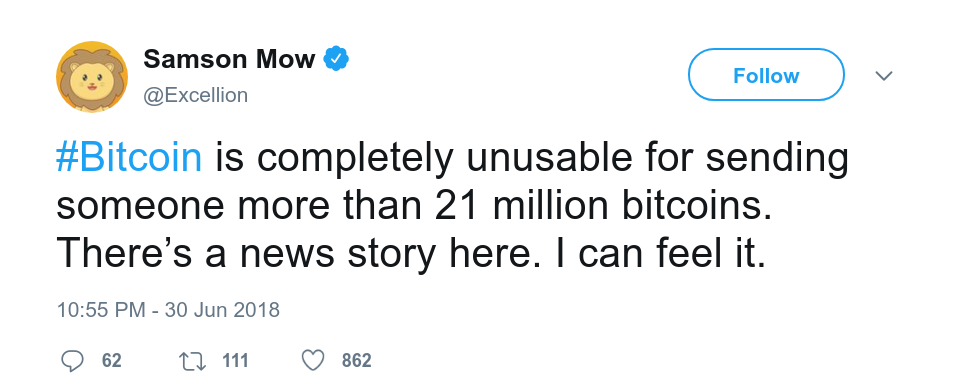
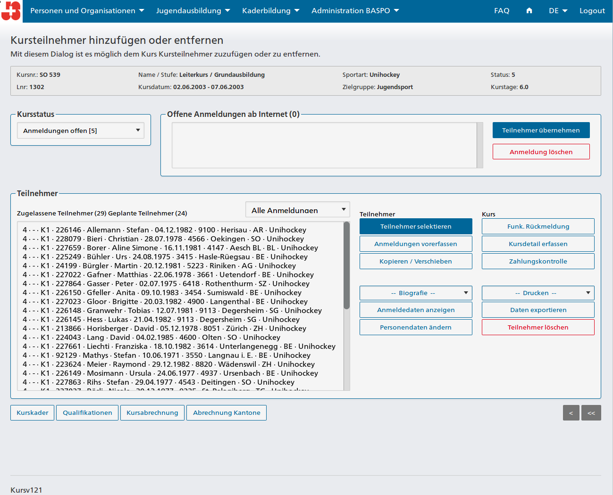
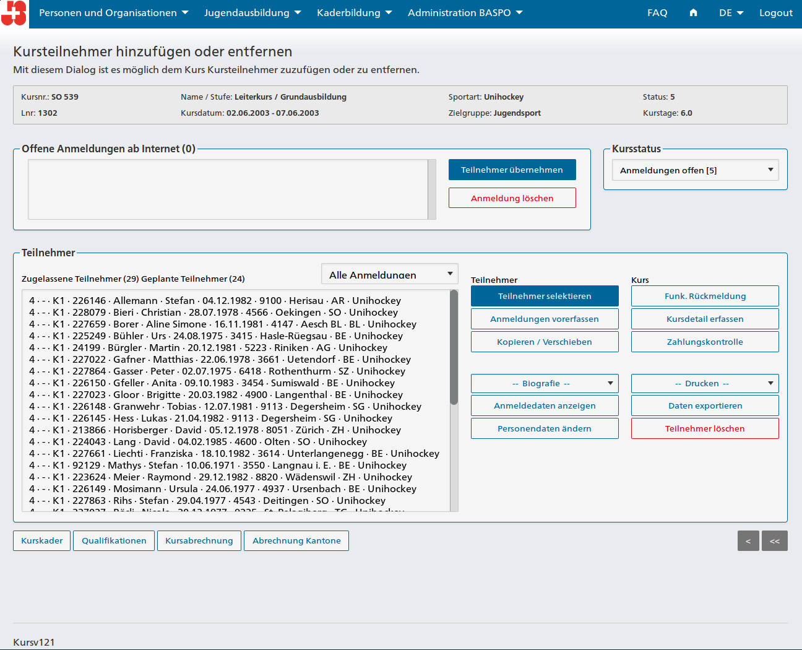
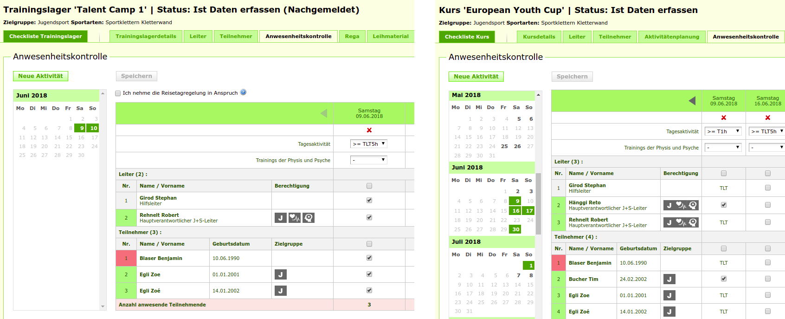
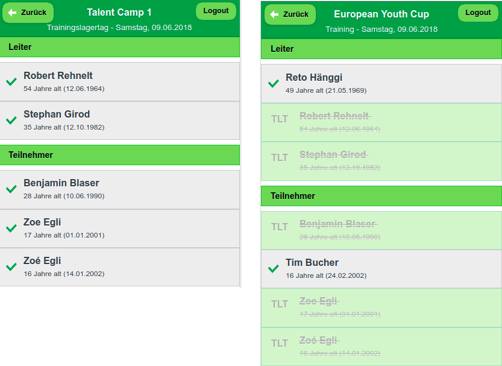
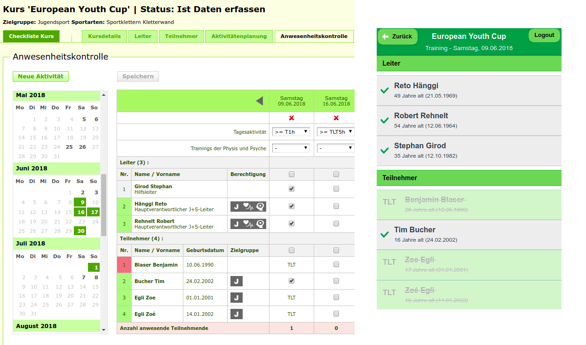
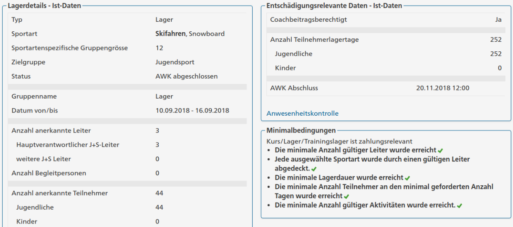
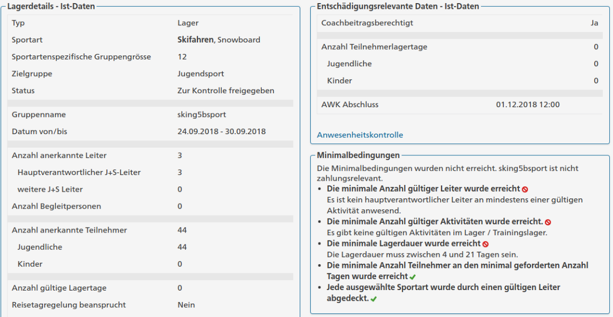

<!-- .slide: class="master01" -->

<!-- section -->
<!-- .slide: class="master02" -->

##Why Bitcoin?


So what *is* the use case for Bitcoin?

<!-- slide -->
<!-- .slide: class="master02" -->

##Some popular Opinions
<!-- also historical ones --> 

* Cash for the Internet
<!-- Direct (no middlemen), fast, more or less anonymous -->
* Cheap Payment System / Micropayments
<!-- Cheap because you cut out the middlemen, amongst other reasons -->
* Darknet Currency
<!-- Because of its anonymity, constant battle between privacy advocates and Blockchain analysis firms -->
* Sound Money / Digital Gold
<!-- Sound Money is all about scarcity, Bitcoin is the first example of absolute scarcity. Never more than 21 million BTC. More about this later. -->
* Banking the Unbanked
<!-- Poor people who cannot get a Bank account CAN get a Bitcoin Wallet -->
* International Payments / Remittance
<!-- Payments across borders can get very expensive -->


<!-- slide -->
<!-- .slide: class="master02" -->

##As perceived today

<br />
*Darknet Currency*

--> lost a lot of its importance.

<!-- slide -->
<!-- .slide: class="master02" -->

##As perceived today

<br />
*Cheap Payment System / Micropayments*

--> Not sustainable on a Blockchain.<br />
Maybe on a layer above?

<!-- slide -->
<!-- .slide: class="master02" -->

##As perceived today

<br />
*Sound Money / Digital Gold*

--> the Holy Grail!
<!-- Once again: Scarcity is a very important feature of money. -->
<!-- Why? Example: Air. Air is extremely important for you, yet you would not sell me even a sandwich for air, because you experience an abundance of air. -->
<!-- So air is NOT good money, not because it is not valuable, but because it is not scarce. -->
<!-- Traditionally there were always two ways how to get money. -->
<!-- You either create a service or a product and sell it for money -->
<!-- OR you directly create money itself. -->
<!-- The problem with the latter is, that you don't provide anything valuable to society, you only profit from it -->
<!-- This is why gold had such an important role in monetary history, because it is very hard to "create new money" as Gold is so scarce in the earths crust -->
<!-- Anyways, there WERE people creating money instead of earning money -->
<!-- And if we used copper as money, instead of gold, a much bigger percentage of the economy would be working on getting copper out of the soil, instead of producing something valuable for society, just because copper is not as scarce as Gold in the earths crust. -->
<!-- But also today money is created, in our system of national paper money, although this time there is even a monopoly on creating money. Central banks and banks can do so, but you are put in jail if you try -->
<!-- Creating Money out of thin air is a phenomen that is omnipresent all over the world, with devastating consequences. (See Venezuela) -->
 
<!-- Bitcoin is fundamentally different. It has the scarcity from precious metals (and even more, it is the first money of absolute scarcity humanity has ever had) and the flexibility (transportation, divisibility, fungibility) of Fiat (even better!) 

<!-- section -->
<!-- .slide: class="master03" -->

### 31280: Anordnung Fieldsets anpassen

```
@author bluginbuehl
```

<!-- slide -->
<!-- .slide: class="master04" -->

#### Vorher



<!-- slide -->
<!-- .slide: class="master04" -->

#### Nachher



<!-- section -->
<!-- .slide: class="master03" -->

### 31279: Leiterpersonen mit Trainingslagertagen nicht blockieren

```
@author sgirod
```

<!-- slide -->
<!-- .slide: class="master04" -->

### Leiterpersonen mit TLT in Kursen nicht blockieren

* AWK / MobileAWK
* AWK-Export


<!-- slide -->
<!-- .slide: class="master04" -->

#### AWK Vorher: Lager vs. Kurs



<!-- slide -->
<!-- .slide: class="master04" -->

#### MobileAWK Vorher: Lager vs. Kurs



<!-- slide -->
<!-- .slide: class="master04" -->

#### Nachher



<!-- section -->
<!-- .slide: class="master03" -->
### 31281: Regelungen B-Sportarten

```
@author rhertle
```

<!-- slide -->
<!-- .slide: class="master04" -->

### Vorher:
Polysportive Lager waren immer als A-Sportart klassifiziert.



<!-- slide -->
<!-- .slide: class="master05" -->

### Nachher:

<div></div>


<!-- section -->
<!-- .slide: class="master03" -->

### 31284: OptiDQ: Workshop 

```
@author sgirod
```

<!-- slide -->
<!-- .slide: class="master04" -->

### Fazit Workshop

* Fortschritt des Konzepts besprochen
* Weiteres Vorgehen definiert
    - Prüfung des Konzepts durch BASPO
    - Weitere Analyse durch Puzzle
    - Kandidaten für Improvements finden
    - Kategorisierung nach Migrationsschritten
     


<!-- section -->
<!-- .slide: class="master01" -->

# Vielen Dank!
