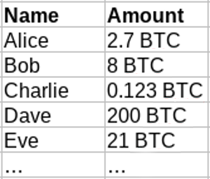
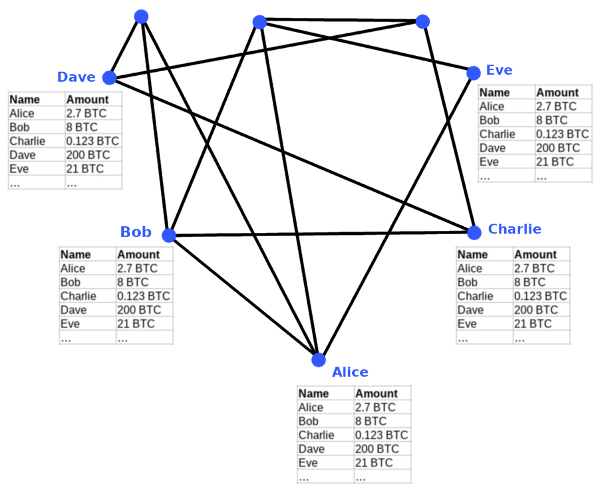
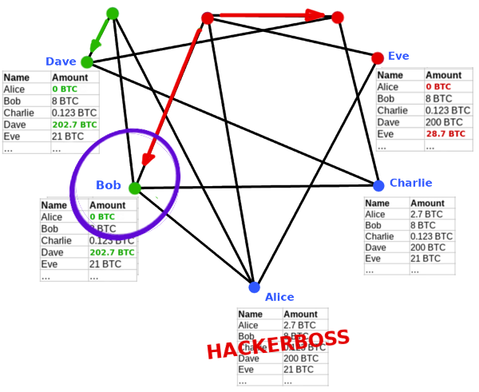

<!-- .slide: class="master01" -->

<!-- section -->
<!-- .slide: class="master02" -->

##Why Bitcoin?

So what *is* the use case for Bitcoin?

<!-- slide -->
<!-- .slide: class="master02" -->

##Some popular Opinions
<!-- also historical ones --> 

* Cash for the Internet
<!-- Direct (no middlemen), fast, more or less anonymous -->
* Cheap Payment System / Micropayments
<!-- Cheap because you cut out the middlemen, amongst other reasons -->
* Darknet Currency
<!-- Because of its anonymity, constant battle between privacy advocates and Blockchain analysis firms -->
* Sound Money / Digital Gold
<!-- Sound Money is all about scarcity, Bitcoin is the first example of absolute scarcity. Never more than 21 million BTC. More about this later. -->
* Banking the Unbanked
<!-- Poor people who cannot get a Bank account CAN get a Bitcoin Wallet -->
* International Payments / Remittance
<!-- Payments across borders can get very expensive -->

<!-- slide -->
<!-- .slide: class="master02" -->

##As perceived today

 
*Darknet Currency*

--> lost a lot of its importance.

<!-- slide -->
<!-- .slide: class="master02" -->

##As perceived today

 
*Cheap Payment System / Micropayments*

--> Not sustainable on a Blockchain. 
Maybe on a layer above?

<!-- slide -->
<!-- .slide: class="master02" -->

##As perceived today

 
*Sound Money / Digital Gold*

--> the Holy Grail!
<!-- Once again: Scarcity is a very important feature of money. -->
<!-- Why? Example: Air. Air is extremely important for you, yet you would not sell me even a sandwich for air, because you experience an abundance of air. -->
<!-- So air is NOT good money, not because it is not valuable, but because it is not scarce. -->
<!-- Traditionally there were always two ways how to get money. -->
<!-- You either create a service or a product and sell it for money -->
<!-- OR you directly create money itself. -->
<!-- The problem with the latter is, that you don't provide anything valuable to society, you only profit from it -->
<!-- This is why gold had such an important role in monetary history, because it is very hard to "create new money" as Gold is so scarce in the earths crust -->
<!-- Anyways, there WERE people creating money instead of earning money -->
<!-- And if we used copper as money, instead of gold, a much bigger percentage of the economy would be working on getting copper out of the soil, instead of producing something valuable for society, just because copper is not as scarce as Gold in the earths crust. -->
<!-- But also today money is created, in our system of national paper money, although this time there is even a monopoly on creating money. Central banks and banks can do so, but you are put in jail if you try -->
<!-- Creating Money out of thin air is a phenomen that is omnipresent all over the world, with devastating consequences. (See Venezuela) -->
 
<!-- Bitcoin is fundamentally different. It has the scarcity from precious metals (and even more, it is the first money of absolute scarcity humanity has ever had) and the flexibility (transportation, divisibility, fungibility) of Fiat (even better!) --> 

<!-- section -->
<!-- .slide: class="master04" -->

### Solution: 
## A Decentralized System!

<!-- slide -->
<!-- .slide: class="master04" -->

## A Decentralized System

###P2P Network
No hierarchy - every node has equal rights.

 
 
Because history shows, if we put an elite in charge, additional money WILL BE created.

<!-- slide -->
<!-- .slide: class="master04" -->

## A Decentralized System

Other reasons:

* Censorship resistance
* System cannot be shut down
* Fees are up to free market (no monopoly)
* No downtime
* No data loss

<!-- slide -->
<!-- .slide: class="master04" -->

## A Decentralized System
In fact: __A decentralized ledger__

Everybody stores the worldwide ledger.

<!-- slide -->
<!-- .slide: class="master04" -->

## A Decentralized System

<!-- slide -->
<!-- .slide: class="master04" -->

Problem solved ✓

<!-- slide -->
<!-- .slide: class="master04" -->

<!-- slide -->
<!-- .slide: class="master04" -->

###Well no, sorry.

This system is NOT SAFE.

 
###Let's attack it! ☠

<!-- well, not really. There is a catch. -->
<!-- This system is not safe! So let's attack it by exploiting an architectural vulnerability called "The Double-Spending Problem". -->

<!-- section -->
<!-- .slide: class="master01" -->

###A Valid Transaction

Alice sends all of her Bitcoin to Eve.

<!-- slide -->
<!-- .slide: class="master01" -->

###The Updated Ledger

<!-- slide -->
<!-- .slide: class="master01" -->

###Alice updates the Ledger

<!-- slide -->
<!-- .slide: class="master01" -->

###Transaction travels through Network

<!-- slide -->
<!-- .slide: class="master01" -->

###Transaction travels through Network

<!-- slide -->
<!-- .slide: class="master01" -->

###Transaction travels through Network

<!-- slide -->
<!-- .slide: class="master01" -->

###Final state
Everybody agrees:

* Eve has 28.7 BTC
* Alice should learn how to deal with money.

<!-- There is a CONSENSUS about the ledger -->

<!-- slide -->
<!-- .slide: class="master01" -->

###Another Valid Transaction

Alice sends all of her Bitcoin to __Dave__.

<!-- slide -->
<!-- .slide: class="master01" -->

###Two Transactions

* Both are valid
* But _only_ if sent first!

<!-- slide -->
<!-- .slide: class="master01" -->

###Our Attack

* Exploit the networks latency
* Pull off a "Double Spending Attack"

<!-- slide -->
<!-- .slide: class="master01" -->

### Alice sends both Transactions

<!-- slide -->
<!-- .slide: class="master01" -->

### Transaction travels through Network

<!-- slide -->
<!-- .slide: class="master01" -->

### Consensus Failure
* For Bob the red transaction is invalid
* For Eve the green transaction will be invalid

WHO IS RIGHT?

<!-- section -->
<!-- .slide: class="master02" -->

### The Double-Spending Problem

Solution: Put transactions in a timed order.

<!-- slide -->
<!-- .slide: class="master02" -->

### But how?

  <!-- .element height="45%" width="45%" -->

Let one node order the transactions.

<!-- What if we let one specific node decide about the order of the transactions -->
<!-- For example Bobs node. -->
<!-- Well this would actually be a centralized system then -->

<!-- slide -->
<!-- .slide: class="master02" -->

### Centralization?

<!-- Well, that is not a solution, because with a centralized approach and we would lose all the benefits we gained from the systems decentralization. -->

<!-- slide -->
<!-- .slide: class="master02" -->

### Instead
* 10-minute-blocks
* Each node is centralized part for one block

 
... but who coordinates this?

<!-- Every node may be the centralized part for ten minutes -->
<!-- First Alice, then Bob, then Charlie, then xxx, then again Alice and so on -->

<!-- slide -->
<!-- .slide: class="master02" -->

### A centralized authority?

<!-- Well, that is not a solution, because with a centralized approach and we would lose all the benefits we gained from the systems decentralization. -->

<!-- slide -->
<!-- .slide: class="master02" -->

### Math and Probability!!
* Everybody creates blocks at will
* All nodes always verify
* There is a block reward
* Each block "contains" a cryptographic puzzle
* ~ The first solution wins

__= Mining__

<!-- slide -->
<!-- .slide: class="master02" -->

### Proof of Work

1) Create your block of choice

2) Brute-force hash the block *(while changing the nonce)*

3) If hash < target ==> broadcast the block

<!-- the "cryptographic puzzle" is actually called proof of work -->
<!-- So you create a block containing of whatever transactions you would like to be inside of it -->
<!-- You also create a reward transaction from nowhere to yourself, inside of this block -->
<!-- Then start hashing the block over and over again, while each time counting up your nonce -->
<!-- The nonce can be as random as it gets, doesn't mean anything -->
<!-- Remember, a hash is nothing but a number -->
<!-- If you achieve a hash that is smaller than the difficulty, then you won. -->
<!-- You can broadcast your block and the other miners will imediately restart mining on top of your Block -->

<!-- slide -->
<!-- .slide: class="master02" -->

### That's it!

The revolutionary technology inside of Bitcoin:
__Decentralized Consensus__

 
... everything else existed before.

<!-- section -->
<!-- .slide: class="master01" -->

# Thank you!
Slides are available on gcomte.github.io
